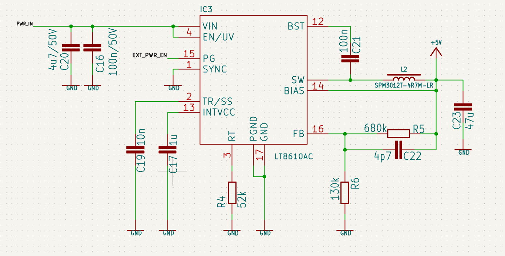
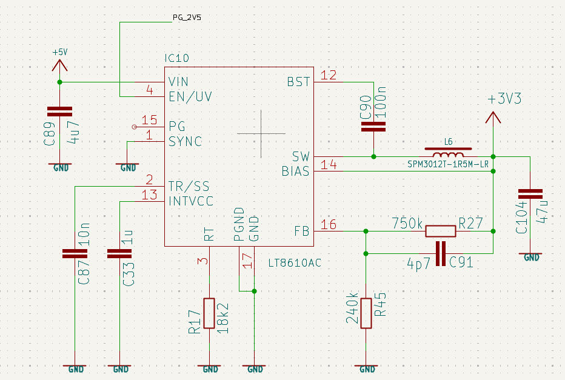

# 4-Channel Motor Controller with ESP32
## Parts

### ESP32
Pin assigment https://github.com/atomic14/esp32-s3-pinouts/blob/main/README.md?utm_source=chatgpt.com

### Motor-driver module
Datasheet: https://www.analog.com/media/en/technical-documentation/data-sheets/TMC2209-BOB_datasheet_rev1.00.pdf
Motor module (KiCAD files): https://www.analog.com/media/en/evaluation-documentation/evaluation-design-files/TMC2209-BOB_Rev1.0.zip

### DC/DC converter
LT8610: https://www.analog.com/media/en/technical-documentation/data-sheets/lt8610.pdf

### Polyswitch
https://cz.mouser.com/ProductDetail/Littelfuse/MINISMDC150F-24-2?qs=F6FIpiMdEVZ%2Fp37J%2FDHAxA%3D%3D